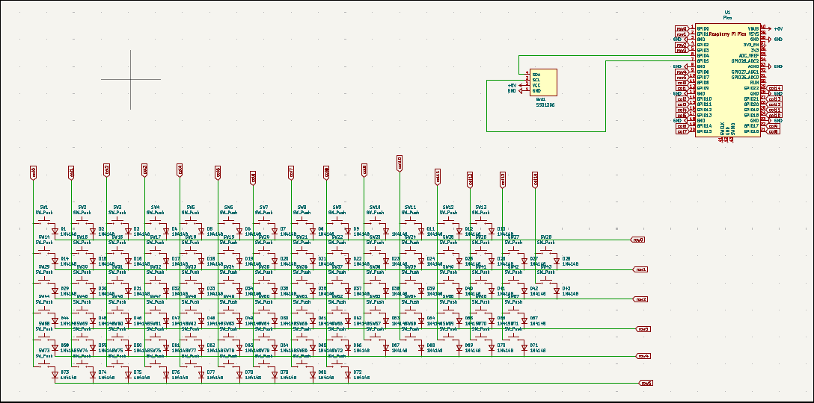

# Keeb

### Why did I make it?
I made it because I want keeb so bed and my keyboar has stop working😭, So, I though I can make it through highway.

### What was the hardest part about this ?
Getting two keebs rejected was the hardest part I hope this one get approved.

Features:

- OLED for Capslock and numpad
- 80x keys
- Raspberry Pi Pico
- Customised layout
- QMK firmware
- HackClub Branded PCB
- Custom case

### Schematic

### PCB 

### Case
- Bottom

- Middle plate

- Top

The space which is remaining and is empty is intetional cause i will be using stickers there

### 3D view of all parts together 

I also have a  secret compartment where you can keep you rubberducky shhh.. dont tell anyone.

## BOM

| Name                                                          | Qty | Final Price - INR (USD) | Link                                                                                                                        |
| ------------------------------------------------------------- | --- | ----------------------- | ----------------------------------------------------------------------------------------------------------                  |
| Gateron EF Grayish                                            | 80  | 1560 ($18.19)           | [here](https://neomacro.in/products/gateron-ef-grayish)                                                                     |
| Durock Smokey Screw-In Stabilizers V2 (4+1 w/ 6.25u spacebar) | 1   | 1590 ($18.58)           | [here](https://stackskb.com/store/durock-smokey-screw-in-stabilizers-v2/)                                                   |
| Cherry Profile PBT Keycaps                                    | 1   | 1300 ($15.15)           | [here](https://stackskb.com/store/veekos-gradient-keycaps-cherry-profile-135-keys)                                          |
| Diode 1N4148 Through - Hole                                   | 100 | 100 ($1.17)             | [here](https://amzn.in/d/j3eLvoh)                                                                                           |
| OLED                                                          | 1   | 166 ($1.92)             | [here](https://amzn.in/d/hVRxzij)                                                                                           |
| M3 x 20mm Bolt                                                | 15  | 149 ($1.73)             | [here](https://amzn.in/d/8GRQWAB)                                                                                           |
| M3 Nuts                                                       | 8   | 100 ($1.16)             | [here](https://amzn.in/d/7UQtsm8)                                                                                           |
| M3 x 5mm Heatset Insert                                       | 25  | 179 ($2.09)             | [here](https://amzn.in/d/ixybuAc)                                                                                           |
| PCB - (Black Color)                                           | 5   | 6037 ($69.99)           ||
| Raspberry Pi Pico                                             | 1   | 449 ($5.19)             | [here](http://amazon.in/Raspberry-Pi-Headers-Soldered-Micro/dp/B08WPNM7JB/ref=sr_1_2?sr=8-2)                                |
| Case- top,mid,bot                                             | 1   | Print Legion

## Total Pricing
The total price comes out to be 11,660.13 INR ($135.17)

The pricing might slightly vary due to flash sales, and dollar market trends.
